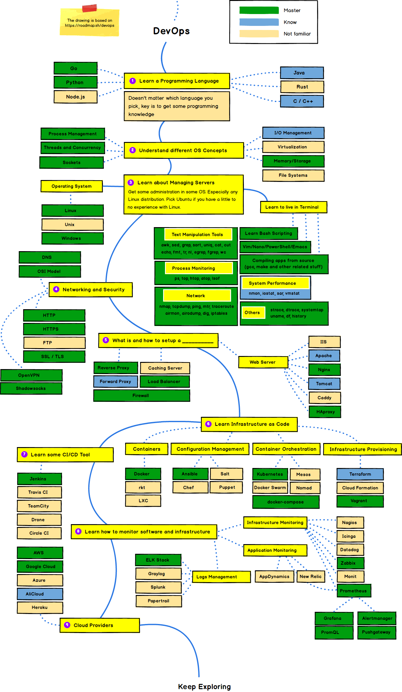

## my-devops-stack
my-devops-stack 是一个 DevOps 技术路线图，基于 [developer-roadmap](https://github.com/kamranahmedse/developer-roadmap) 修改，在其基础上做了略微的补充。该项目的目的是实时展示个人目前阶段所掌握的 DevOps 技术栈，随着技术的提升会持续更新路线图。

该技术路线图使用 [Balsamiq](https://balsamiq.com/wireframes/desktop/) 绘制，支持图表导入导出 json 文件。

